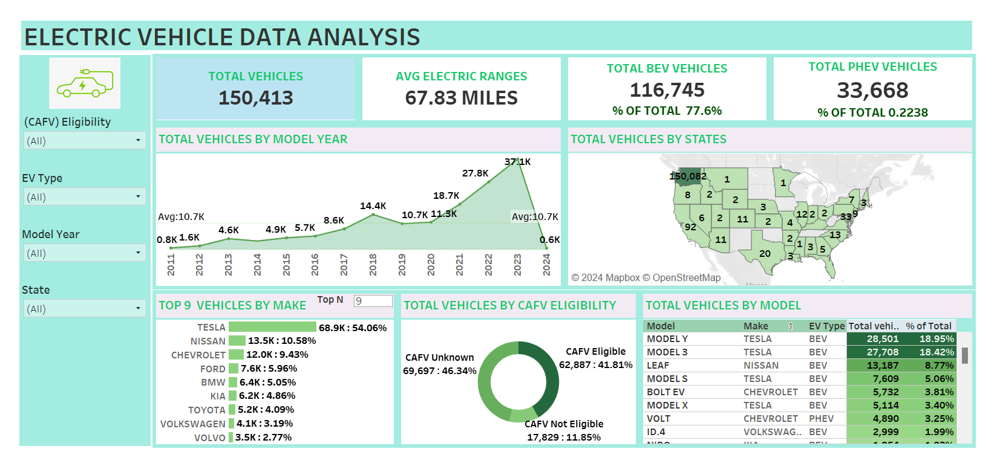

 
# Electric Vehicle Data Analysis Dashboard
 
This project involves analyzing a dataset on electric vehicle (EV) registrations across the United States. The goal is to gain insights into EV adoption trends, model popularity, manufacturer dominance, and state-wise distribution, all visualized through an interactive dashboard. This project helps understand the market dynamics of electric vehicles and the effectiveness of policies encouraging EV adoption.
 

 

[Link to Tableau Dashboard](https://public.tableau.com/app/profile/amit.pandit8190/viz/ElectricVehicledataVisualization/ELECTRICVEHICLEDATAANALYSIS?publish=yes)

 

## Summary

**Growth in EV Adoption**: Electric vehicle registrations have surged over the years, peaking in 2023 with 37.1K new registrations, showcasing rapid growth in EV adoption.

**BEV Dominance:** Battery Electric Vehicles (BEVs) account for 77.6% of all EVs, indicating a strong market preference for fully electric vehicles over Plug-in Hybrid Electric Vehicles (PHEVs).

**Geographic Concentration**: Washington leads with the highest number of EV registrations, suggesting a concentrated adoption in states with supportive policies and infrastructure.

**Top EV Manufacturers:** Tesla dominates the EV market, holding 54.06% of all registered EVs. Other leading manufacturers include Nissan, Chevrolet, and Ford.

**Popular Models:** The Tesla Model Y and Model 3 are the top registered models, reflecting strong consumer demand for Tesla’s offerings.

**CAFV Eligibility:** About 41.81% of EVs are eligible for Clean Alternative Fuel Vehicle (CAFV) incentives, highlighting the influence of incentives on EV adoption.

## Project Overview
 
The Electric Vehicle Data Analysis Dashboard is designed to provide insights into the growing landscape of electric vehicles in the U.S. Using this dashboard, users can analyze the distribution of EVs across states, identify top manufacturers and models, and view trends in EV adoption over time.
 

## Objectives
The primary goals of this project are:
 

**Understand the EV Market Landscape:** Assess the number of electric vehicles by type, model, and manufacturer to understand the growth and dominance in the market.
 

**Analyze Electric Range:** Determine the average electric range across EVs, providing insights into technological advancements.

**State-wise Distribution:** Identify regions with higher adoption rates by analyzing state-wise EV distribution.

**CAFV Eligibility Analysis:** Assess the impact of incentive eligibility on vehicle adoption.

## Key Metrics and Visualizations

**Total Vehicles**: Display the total count of electric vehicles in the dataset, split into BEVs (Battery Electric Vehicles) and PHEVs (Plug-in Hybrid Electric Vehicles).

**Average Electric Range:** Calculate and display the average electric range across all EVs.

**Total Vehicles by Model Year:** Show the trend of EV registrations over the years, indicating growth in adoption.

**Total Vehicles by State:** Visualize the geographical distribution of EVs across U.S. states.

**Top 10 Vehicles by Make and Model:** Display the most popular manufacturers and models to understand brand and model preferences.

**CAFV Eligibility:** Illustrate the proportion of vehicles eligible for Clean Alternative Fuel Vehicle incentives.

## Skills and Tools Used

**Data Visualization** - Developed insightful visualizations (line, bar, map, pie, and tree map) to illustrate key metrics.

**Dashboard Design** - Created an interactive dashboard to consolidate and present EV data in an easily accessible format.

**SQL** - Used SQL for data querying, cleaning, and preparing metrics displayed in the dashboard.

**Tableau** - Leveraged Tableau to create dynamic and interactive charts that showcase data insights visually.

**Data Analysis** - Conducted in-depth data analysis to identify trends, popular models, and the impact of incentives.

